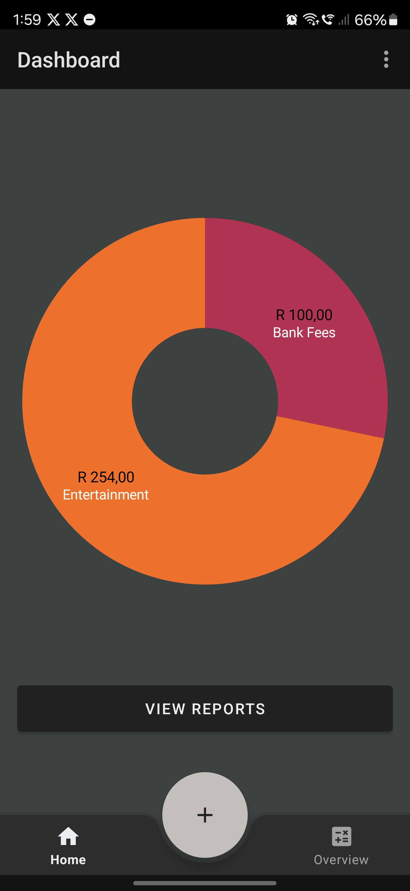
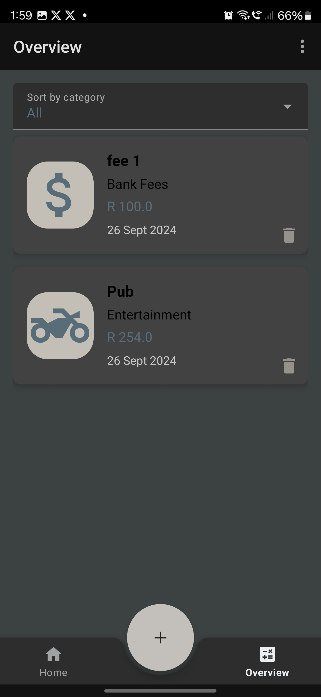
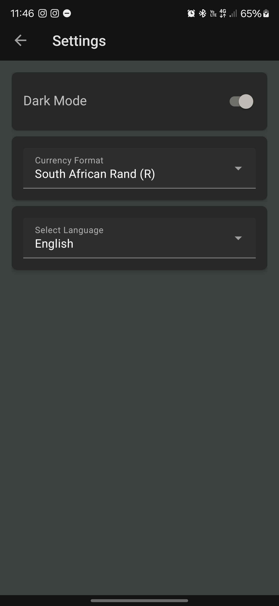
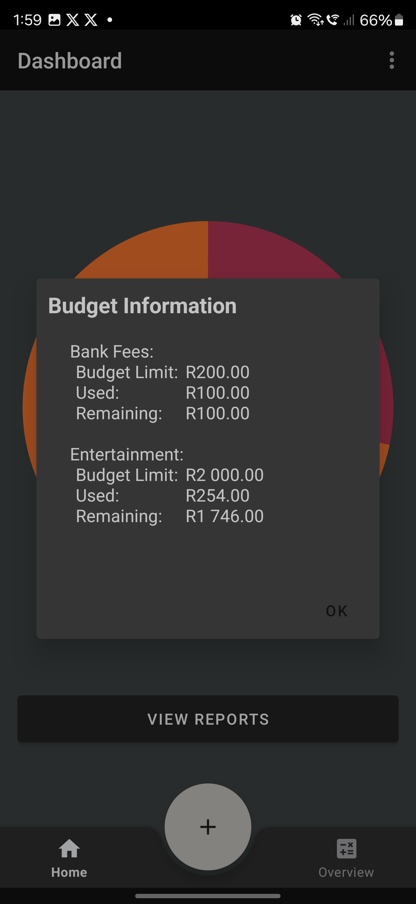
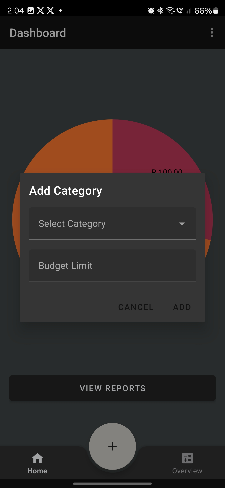
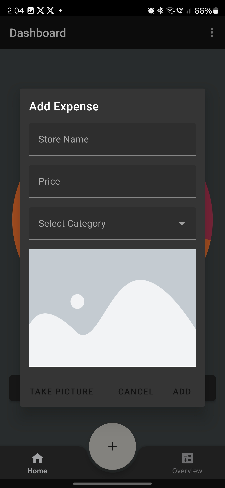

# WalletMaven - A Budget-Conscious Android Application

WalletMaven is an expense management application designed to help users monitor and track their daily spending efficiently. The app provides an easy-to-use interface, enabling users to add expenses, categorise them, and attach images, making it an ideal solution for budget-conscious individuals. The project employs GitHub for version control and GitHub Actions for seamless CI/CD.

---

## Table of Contents

- [Design Considerations And Features](#design-considerations-and-features)
- [Hardware Specifications](#hardware-specifications)
- [Run Instructions for APK](#run-instructions-for-apk)
- [How to Use](#how-to-use)
- [About WalletMaven API](#about-walletmaven-api)
- [Functionality](#functionality)
- [FAQs](#faqs)
- [Code Attributions](#code-attributions)
- [Developer Information](#developer-information)
- [Dependencies Used](#dependencies-used)

---

## Purpose of the App

The purpose of WalletMaven is to provide a straightforward and effective way to manage personal expenses. By allowing users to categorise expenses, attach images, and maintain records over time, WalletMaven aims to improve financial awareness and budgeting habits. The app is ideal for individuals looking to gain better control over their spending.

---

## Design Considerations And Features

### User Interface
- **Budgeting System**: WalletMaven offers a comprehensive budgeting system that empowers users to create and manage detailed budgets tailored to their financial goals. Users can set limits, track their spending, and receive alerts when approaching their budget limits, promoting financial discipline and better money management.





- **Visual Reporting**: The app features a visual reporting tool that enables users to view their financial data in an easy-to-understand graphical format, such as charts and graphs. This feature aids users in identifying spending trends, understanding their habits, and pinpointing areas for financial improvement.




### Database

- **Real-Time Synchronisation**: With WalletMaven, real-time data synchronisation across all devices ensures that users always have the latest financial information at their fingertips. Whether accessed on an Android smartphone or tablet, the app ensures that changes are instantly reflected, providing seamless and up-to-date tracking.

- **Offline Functionality**: Recognising the importance of accessibility, WalletMaven offers offline functionality, allowing users to track expenses and manage budgets even without an internet connection. Once the connection is restored, all changes are automatically synchronised, ensuring data consistency across devices.

### New Features
- **Biometric Authentication**: WalletMaven includes biometric support, enabling users to securely log in using their fingerprint or facial recognition. This enhances security and convenience for accessing personal financial data.

- **Real-Time Notifications**: The app integrates with Firebase Messaging to deliver real-time notifications, keeping users informed about their spending, budget alerts, and other important updates.

- **Multi-Language Support**: WalletMaven now supports multiple languages, including English and Afrikaans, allowing users to select their preferred language for a more personalised experience.

-- **Offline Functionality**: [here](#Offline-Functionality)

### Features

- **Multi-Currency Support**: Designed for users who travel frequently or handle finances in various currencies, WalletMaven supports multi-currency tracking. The app automatically converts expenses into the user's base currency, ensuring accurate and seamless budget tracking.

- **Picture Handling(<span style="color: red;">Google ML Kit TBI</span>)**: WalletMaven takes pictures of receipts, adding visual representation. Users can snap a picture of their receipts.

- **Customisable Categories and Expenses**: Acknowledging that every user has unique financial needs, WalletMaven offers the flexibility to customise categories for expenses and income. Users can create, manage, and tailor these categories to align with their personal financial goals and tracking preferences.




- **Dark Mode**: To enhance user experience, WalletMaven includes a Dark Mode feature that allows users to switch the app's interface to a darker theme. This feature not only reduces eye strain in low-light conditions but also conserves battery life on devices with OLED screens.

---

## GitHub and GitHub Actions Usage

### GitHub
- **Version Control**: All project changes and updates are managed via GitHub, ensuring a seamless development workflow.
- **Collaboration**: Issues and pull requests are used to handle development tasks and bug fixes.

### GitHub Actions
- **CI/CD Pipeline**: GitHub Actions is configured to automate the build and test processes, ensuring any changes pushed to the repository are properly verified.


---

## Hardware Specifications

| **Specification**          | **Android App**                             |
|----------------------------|---------------------------------------------|
| **Operating System**       | Android 6.0 (Marshmallow) or higher         |
| **Processor**              | Quad-core 1.4 GHz or faster                 |
| **RAM**                    | 2 GB or more                                |
| **Storage**                | 100 MB of free space                        |
| **Network Connectivity**   | Wi-Fi / Mobile data for syncing and updates |
| **Framework**              | N/A                                         |
| **Screen Resolution**      | 720 x 1280 pixels or higher                 |


---

## Run Instructions for APK

1. **Download the latest version** of WalletMaven APK from the [Releases](https://github.com/VCWVL/WalletMaven/releases) section on GitHub.
2. **Transfer the APK** to your Android device if downloaded on a computer, or access it directly from your device.
3. **Enable installation from unknown sources**:
   - Go to **Settings** > **Security**.
   - Toggle on **Unknown Sources** to allow installations from sources other than the Play Store.
4. **Install the APK** by opening the downloaded file and following the on-screen prompts.
5. Once the installation is complete, you can find WalletMaven on your home screen or app drawer.
6. **Launch WalletMaven** and follow the [setup instructions](#how-to-use) to get started.

## Find of Google Play
- Go to Google Play and search for ```WalletMavent```
- Click ```install```
- Open App and Enjoy.

---

## How to Use

1. **Login** or **Register** using your Google account.
2. **Create a Category**:
   - Navigate to the `Categories` section in the app.
   - Click on the `Add Category` button.
   - Enter the desired name for your category and budget limit
   - Click `Add` to save the category.
3. **Add an Expense**:
   - Click the `Add Expense` button.
   - Fill in the required details like `Store Name`, `Price`, and select the category you just created.
   - Optionally, attach an image for your expense.
   - Click `Add` to save the expense.
4. **Deleting Expenses**: If you delete all expenses within a category, that category will automatically be deleted from the system, keeping your categories organised.


---

## About WalletMaven API

The **WalletMaven API** is a custom-built .NET Core Web API that serves as the backend service for the WalletMaven app, providing a secure and efficient way to manage financial data. It plays a crucial role in handling various aspects of the app, including:

- **Expense Management**: Allows the app to store, retrieve, update, and delete expense records efficiently.
- **Category Management**: Provides endpoints for managing categories, allowing users to personalise their expense categories.
- **User Authentication**: Utilises secure authentication mechanisms, ensuring that users’ financial data is protected. Integration with Firebase Authentication further ensures seamless login experiences for users.
- **Data Synchronisation**: Ensures real-time synchronisation of data, allowing users to access up-to-date information across multiple devices.
- **Multi-Currency Support**: Handles currency conversion and storage, allowing the app to support various currencies for international users.

### API Endpoints
The API offers several endpoints, including:
- **/expenses**: For creating, reading, updating, and deleting expense records.
- **/categories**: For managing categories related to expenses.

### Technical Specifications
- **Framework**: Built on **.NET Core**, which ensures cross-platform compatibility and high performance.
- **Database**: Utilises **Firestore** for storing all expense, category, and user data securely.

This API ensures that all interactions between the WalletMaven app and the backend are secure, efficient, and scalable. It forms the backbone of WalletMaven's core features, providing users with a seamless and responsive experience when managing their finances.


## Functionality

- **Expense Tracking**: Easily add, view, and categorise expenses.
- **Image Attachment**: Attach images to each expense for visual reference.
- **Expense Reports**: View summaries of your expenses across different categories.


---

## FAQs

**Q1: Is WalletMaven free to use?**  
A1: Yes, WalletMaven is completely free with no hidden charges.

**Q2: Can I access my expenses from multiple devices?**  
A2: Yes, expenses are synced in real-time via your account.

**Q3: How can I change the language to Afrikaans?**  
A2: Go to ```Settings``` in top right, then click language dropdown and select ```Afrikaans```

---

## Change Log

- **Biometric Authentication**: Added support for secure login using biometric authentication (fingerprint and facial recognition).
- **Real-Time Notifications**: Added real-time notifications through Firebase Messaging to keep users updated with alerts and reminders about their expenses and budgets.
- **Offline Mode with Room Database**: Implemented offline functionality using Room Database, enabling users to track expenses and manage budgets without an internet connection. Changes are automatically synced when connectivity is restored.
- **Multi-Language Support**: Launched multi-language support for English and Afrikaans, allowing users to select their preferred language for a more personalised experience.
- **Development of Android Application and API**: Continued development of the WalletMaven Android application and its corresponding API, focusing on features that streamline expense tracking and management.

## Code Attributions

The app utilises several libraries and services to enhance functionality:

- **Custom API - WalletMavenAPI**: Provides endpoints for tracking expenses, categories, and synchronising data across devices.
- **Glide**: Used for efficient image loading and caching within the app, making it easy to handle image display from various sources.
- **Firebase**: Offers authentication services, enabling secure sign-in and user management. It also integrates with the real-time database to maintain up-to-date data for users' expenses and budgets.
- **Google Sign-In**: Simplifies user login by allowing them to sign in with their Google accounts, providing a seamless authentication experience.
- **Retrofit**: A type-safe HTTP client used for communicating with the WalletMavenAPI, enabling smooth data retrieval and updates.
- **Material Design Components**: Used for building a user-friendly and visually appealing interface that adheres to Android design guidelines.
- **AndroidX Libraries**: Provides support for backward compatibility, lifecycle management, and improved navigation.

For a complete list of libraries and dependencies used, please refer to the [build.gradle](https://github.com/VCWVL/WalletMaven/blob/main/app/build.gradle) file in the repository.

---

## Developer Information

- **Developer**: Jaime Marc Futter
- **Email**: ST10067405@vcconnect.edu.za
- **GitHub**: [GitHub Repo]([https://github.com/VCWVL/WalletMaven](https://github.com/VCWVL/opsc7312-poe-ST10067405)
- **YouTube Demo**: [YouTube Demo](#)

---

## Dependencies Used

| **Dependency**                           | **Purpose**                                             | **Source**                                                       |
|------------------------------------------|---------------------------------------------------------|------------------------------------------------------------------|
| `androidx.preference`                    | Provides preferences support for Android applications   | [AndroidX](https://developer.android.com/jetpack/androidx/releases/preference) |
| `androidx.preference.ktx`                | Kotlin extensions for AndroidX preferences              | [AndroidX](https://developer.android.com/jetpack/androidx/releases/preference) |
| `firebase.auth`                          | Firebase Authentication for user management             | [Firebase](https://firebase.google.com/docs/auth)                |
| `material`                               | Material Design components                              | [Material Components](https://github.com/material-components/material-components-android) |
| `mpandroidchart`                         | Charting library for Android                            | [MPAndroidChart](https://github.com/PhilJay/MPAndroidChart)      |
| `retrofit`                               | Type-safe HTTP client for Android                       | [Retrofit](https://square.github.io/retrofit/)                   |
| `converter.gson`                         | Converts JSON to Java objects using Gson with Retrofit  | [Gson Converter](https://github.com/square/retrofit/tree/master/retrofit-converters) |
| `logging.interceptor`                    | Logs HTTP requests/responses for debugging Retrofit     | [OkHttp Logging Interceptor](https://github.com/square/okhttp/tree/master/okhttp-logging-interceptor) |
| `play.services.auth`                     | Google Sign-In integration                              | [Google Play Services Auth](https://developers.google.com/identity/sign-in/android/start) |
| `glide`                                  | Image loading and caching library                       | [Glide](https://github.com/bumptech/glide)                      |
| `compiler`                               | Glide annotation processor                              | [Glide Compiler](https://github.com/bumptech/glide)             |
| `gson`                                   | Converts Java objects to JSON and vice versa            | [Gson](https://github.com/google/gson)                          |
| `androidx.core.ktx`                      | Kotlin extensions for AndroidX Core                     | [AndroidX](https://developer.android.com/kotlin/ktx)            |
| `androidx.appcompat`                     | Support for modern Android app features                 | [AndroidX AppCompat](https://developer.android.com/jetpack/androidx/releases/appcompat) |
| `androidx.constraintlayout`              | Enables constraint-based layout design                  | [ConstraintLayout](https://developer.android.com/reference/androidx/constraintlayout/widget/ConstraintLayout) |
| `androidx.lifecycle.livedata.ktx`        | LiveData with lifecycle-awareness                       | [AndroidX Lifecycle](https://developer.android.com/jetpack/androidx/releases/lifecycle) |
| `androidx.lifecycle.viewmodel.ktx`       | ViewModel with lifecycle-awareness                      | [AndroidX Lifecycle](https://developer.android.com/jetpack/androidx/releases/lifecycle) |
| `androidx.navigation.fragment.ktx`       | Navigation support for fragments                        | [AndroidX Navigation](https://developer.android.com/guide/navigation) |
| `androidx.navigation.ui.ktx`             | Navigation UI helpers                                   | [AndroidX Navigation](https://developer.android.com/guide/navigation) |
| `androidx.activity`                      | Provides Activity compatibility components              | [AndroidX Activity](https://developer.android.com/jetpack/androidx/releases/activity) |
| `junit`                                  | Testing framework for unit tests                        | [JUnit](https://junit.org/junit5/)                             |
| `androidx.junit`                         | JUnit extensions for Android                            | [AndroidX Test](https://developer.android.com/jetpack/androidx/releases/test) |
| `androidx.espresso.core`                 | UI testing framework for Android                        | [Espresso](https://developer.android.com/training/testing/espresso) |

---
